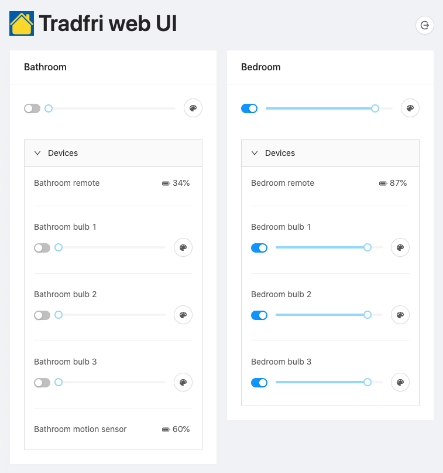

# Tradfri web UI

A React and GraphQL based progressive web app for connecting to a Tradfri gateway and controlling attached devices.



## Setup

1. Install dependencies: `npm i`
2. Copy the Security code from your Tradfri gateway and generate credentials: `npm run authenticate <security code>`
3. Create a `.env` file with the following values set:

   ```dotenv
   IDENTITY=<identity>
   PSK=<psk>
   REACT_APP_SERVER_PORT=8080
   ```

4. Build the frontend: `npm run build`
5. Start the server: `npm run server`
