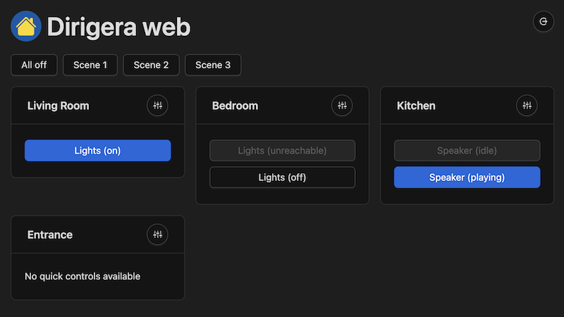
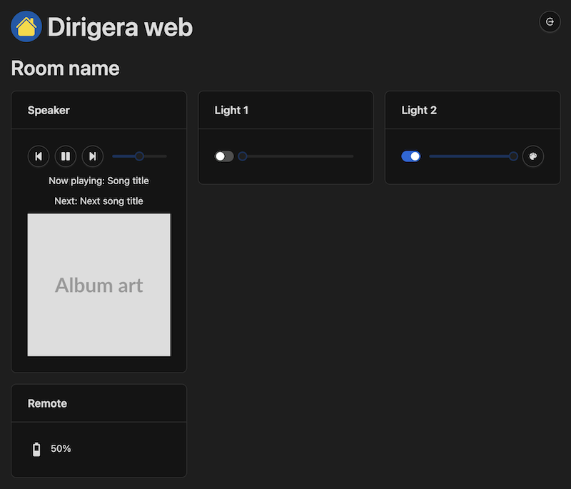

# Dirigera web

Dirigera web is a web-based interface for controlling smart home devices connected to the IKEA Dirigera gateway. The app
is designed to be run on a home server (such as a Raspberry Pi) on the same network as the gateway. It provides a
user-friendly interface for controlling your smart home devices, and can be accessed from any device with a web browser.

<details>
  <summary>Screenshots 📸</summary>
  <hr />
  
  <hr />
  
  <hr />
</details>

Check out the latest non-interactive Storybook to see the UI at
[Chromatic](https://www.chromatic.com/library?appId=61753f54931d3b003a535d15&branch=master)

> Are you looking for the old Tradfri web ui?
> [Switch to the tradfri branch](https://github.com/lpgera/tradfri-web-ui/tree/tradfri)

## Environment Variables

The app uses environment variables to configure its behavior. You can set these variables in a `.env` file located in
the project directory:

- `GATEWAY_IP` (optional) - The IP address of the Dirigera gateway. If not specified, the app will attempt to discover
  the gateway automatically.
- `ACCESS_TOKEN` - Your access token for the Dirigera gateway. You can obtain this token using the
  [dirigera](https://github.com/lpgera/dirigera) CLI tool by running `npx dirigera authenticate` and following the
  instructions.
- `JWT_SECRET` - A secret key used to sign JSON web tokens (JWTs) for user authentication.
- `JWT_EXPIRY` (optional) - The expiration time for JWTs. Defaults to "1 day".
- `PASSWORD` - The password for the web interface.
- `PORT` (optional) - The port on which the app will listen for incoming connections. Defaults to 4000.

Your `.env` file should look something like this:

```
GATEWAY_IP=192.168.1.2
ACCESS_TOKEN=your-gateway-access-token
JWT_SECRET=your-random-secret-key
JWT_EXPIRY=7 days
PASSWORD=your-password
PORT=4000
```

Replace the values with your own.

## Running with Docker

To run the app with Docker, you can use the following command:

```
docker run -d \
  -p 4000:4000 \
  --env-file .env \
  --name dirigera-web \
  ghcr.io/lpgera/dirigera-web
```

This command tells Docker to run the app in a container, with port 4000 on the container mapped to port 4000 on the host
system. It also specifies the `.env` file containing the required environment variables.

## Running with Docker Compose

To run the app with Docker Compose, create a `docker-compose.yml` file with the following contents:

```
version: "3"

services:
  dirigera-web:
    image: ghcr.io/lpgera/dirigera-web
    container_name: dirigera-web
    env_file: .env
    ports:
      - "4000:4000"
    restart: unless-stopped
```

Then run the following command:

```
docker-compose up -d
```

This command tells Docker Compose to run the app in a container, with port 4000 on the container mapped to
port 4000 on the host system. It also specifies the `.env` file containing the required environment variables.

## Running with Node.js natively

```
git clone git@github.com:lpgera/dirigera-web.git
```

Then navigate to the cloned directory and install dependencies:

```
cd dirigera-web
npm install
```

Finally, start the server:

```
npm start
```

## Contributions

The app was created mainly to serve my own needs, but I'm happy to accept contributions. If you have a device which is
not supported, feel free to open a pull request. If you have any questions, please open an issue.

## License

This project is licensed under the terms of the MIT license. See the [LICENSE](./LICENSE) file for details.
